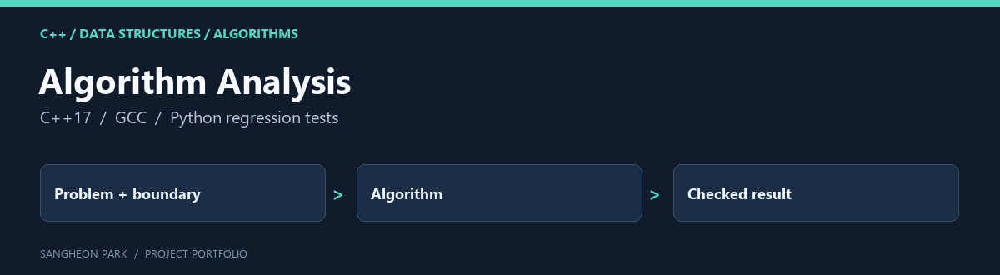

# Algorithm Analysis



Four C++ coursework programs exploring heaps, recursive versus dynamic-programming search, optimisation and depth-first graph traversal.

[Portfolio home](https://github.com/oldprize47-SH) · [Original repository](https://github.com/oldprize47/Algorithm-Analysis_2025)

## Contribution and context

The source retains its course references and existing AI/tool attribution. This portfolio fork adds a small regression suite and fixes demonstrated boundary/output defects; it does not replace the original coursework history.

## Code map

| Entry | Purpose |
|---|---|
| [ALgorithm_HW1_21800275_SangheonPark.cpp](ALgorithm_HW1_21800275_SangheonPark.cpp) | Max-heap exercise |
| [ALgorithm_HW3_21800275_SangheonPark.cpp](ALgorithm_HW3_21800275_SangheonPark.cpp) | Recursive and DP minimum-attempt comparison |
| [ALgorithm_HW4_21800275_SangheonPark.cpp](ALgorithm_HW4_21800275_SangheonPark.cpp) | Optimisation comparison |
| [ALgorithm_HW5_21800275_SangheonPark.cpp](ALgorithm_HW5_21800275_SangheonPark.cpp) | DFS and conditional topological ordering |
| [tests/test_regressions.py](tests/test_regressions.py) | Compile-and-execute regression tests |

## Build and verify

With `g++` and Python on PATH, from the repository root:

```sh
g++ -std=c++17 -Wall -Wextra ALgorithm_HW3_21800275_SangheonPark.cpp -o hw3
python -m unittest discover -s tests -v
```

On 2026-09-28, all four programs compiled with GCC 14.2.0. Existing warnings in
HW1/HW3 remain. The five regression tests passed after an expected failing run:

- zero-floor DP returns zero without indexing outside the vector;
- the 10-floor, 2-object case returns four attempts in both methods;
- a cyclic graph is not presented as having a topological order;
- a three-node DAG preserves its edge ordering;
- zero, oversized and nonnumeric graph sizes are rejected.

The tests enable libstdc++ debug checks. They do not establish correctness of every
algorithm or the timing claims in the historical comments. HW4 can be expensive;
its full timing experiment was not repeated.

## Archive policy

The fork retains upstream history, source attributions and course material. The
portfolio documentation does not assign a new licence or claim sole authorship
of inherited code. Current checks are stated above; an untested component is not
presented as verified.
