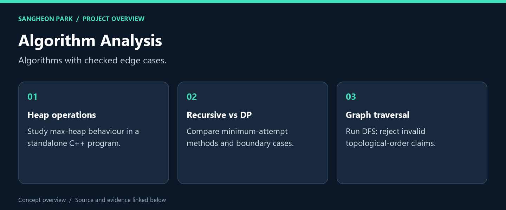
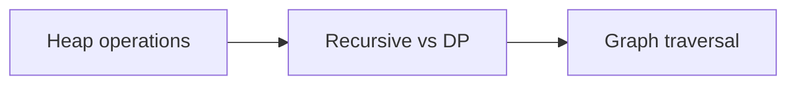

# Algorithm Analysis

**Four C++ coursework programs, with regression checks added for zero-size inputs, invalid graph sizes and cycles.**



[What I built](#what-i-built) · [My role](#my-role) · [Code and reproduction](#code-and-reproduction) · [Portfolio](https://github.com/oldprize47-SH)

## What I built

| Deliverable | What it does | Explore |
|---|---|---|
| **Dynamic programming** | Compare recursive and DP solutions | [Source / result](ALgorithm_HW3_21800275_SangheonPark.cpp) |
| **Graph traversal** | DFS and cycle-aware output | [Source / result](ALgorithm_HW5_21800275_SangheonPark.cpp) |
| **Executable checks** | Five compile-and-run regression tests | [Source / result](tests/test_regressions.py) |

### Result at a glance

4 programs compiled with GCC 14.2.0; 5 regression tests passed on 28 Sep 2026. Existing HW1/HW3 warnings remain.

## My role

The source retains its course references and existing AI/tool attribution. This portfolio fork adds a small regression suite and fixes demonstrated boundary/output defects; it does not replace the original coursework history.

## How it works



The diagram is a reading route through separate exercises, not one integrated runtime.

## Code and reproduction

## Build and verify

With `g++` and Python on PATH, from the repository root:

```sh
g++ -std=c++17 -Wall -Wextra ALgorithm_HW3_21800275_SangheonPark.cpp -o hw3
python -m unittest discover -s tests -v
```

On 2026-09-28, all four programs compiled with GCC 14.2.0. Existing warnings in
HW1/HW3 remain. The five regression tests passed after an expected failing run:

- zero-floor DP returns zero without indexing outside the vector;
- the 10-floor, 2-object case returns four attempts in both methods;
- a cyclic graph is not presented as having a topological order;
- a three-node DAG preserves its edge ordering;
- zero, oversized and nonnumeric graph sizes are rejected.

The tests enable libstdc++ debug checks. They do not establish correctness of every
algorithm or the timing claims in the historical comments. HW4 can be expensive;
its full timing experiment was not repeated.

## Source and credits

[Original repository](https://github.com/oldprize47/Algorithm-Analysis_2025) · [Portfolio home](https://github.com/oldprize47-SH)

Course scaffolding, team contributions and third-party assets retain their original attribution. This documentation does not grant a new licence.
