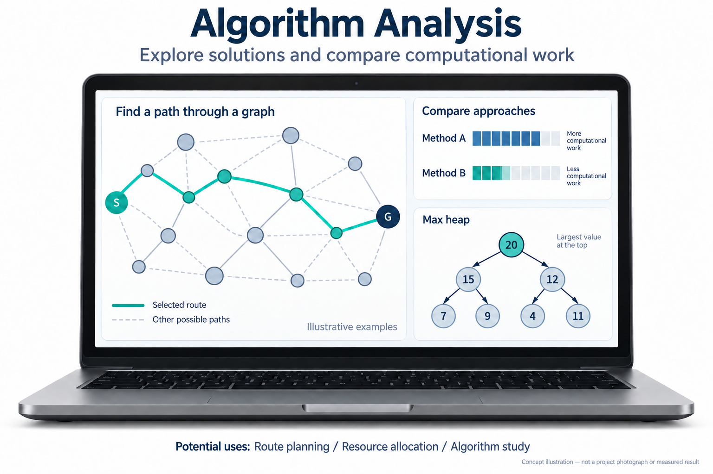
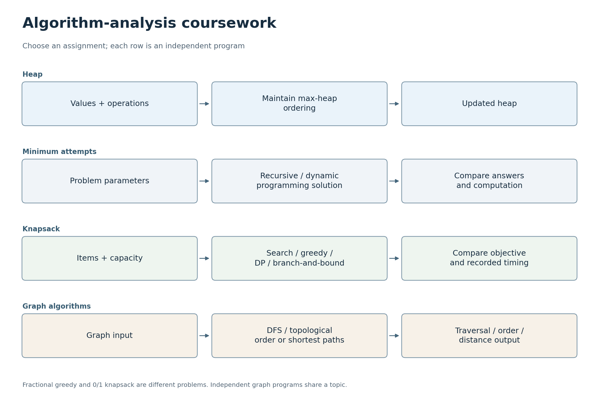

# 알고리즘


[한국어](#korean) · [English](#english)


<a id="korean"></a>

## 한국어

[코드 읽는 순서](#코드-따라-읽기)


이 저장소에는 2025년 알고리즘 분석 수업에서 작성한 C++ 프로그램 다섯 개가 있습니다. 최대 힙, 재귀 및 동적 계획법을 이용한 풀이, 최적화, 깊이 우선 그래프 탐색, 최단 경로를 다룹니다.


### 프로젝트 목표


여러 알고리즘 접근법을 구현하고, 각 접근법의 답과 전제 조건, 계산 작업량이 어떻게 다른지 이해합니다.





<sub>AI 생성 개념도</sub>


### 활용할 수 있는 곳


그래프 실습은 경로 선택 및 네트워크 분석과 연결되며, 힙과 다른 자료구조 실습은 프로그램이 작업을 효율적으로 구성하는 방법을 보여 줍니다. 이 구현들은 더 큰 경로 탐색이나 자원 할당 문제에 접근법을 적용하기 전에 알고리즘 선택지를 비교할 수 있는, 작고 직접 살펴보기 쉬운 예제로 활용할 수 있습니다. 수업 과제 프로그램으로 살펴볼 수 있으며, 계획 수립 서비스로 배포된 것은 아닙니다.


### 한눈에 보기





<sub>[SVG](docs/flowcharts/algorithms.svg)</sub>


### 프로그램


Sangheon Park가 제출한 수업 과제입니다. 수업 참고자료와 기존 AI·도구 활용 표기는 소스에 그대로 남아 있습니다.


- [HW1](ALgorithm_HW1_21800275_SangheonPark.cpp): 최대 힙 연산.

- [HW3](ALgorithm_HW3_21800275_SangheonPark.cpp): 최소 시도 횟수 문제에 대한 재귀 및 동적 계획법 접근.

- [HW4](ALgorithm_HW4_21800275_SangheonPark.cpp): 최적화 방법 비교.

- [HW5](ALgorithm_HW5_21800275_SangheonPark.cpp): 비순환 그래프의 DFS와 위상 정렬.


포트폴리오를 갱신하면서 경계 사례에 대한 회귀 테스트를 추가했습니다. 이 테스트는 층이 없는 경우에 발생하는 범위 밖 접근과, 순환 그래프에도 위상 순서가 있는 것처럼 잘못 표시하는 그래프 출력을 찾아냈습니다. 이 포크에서는 해당 사례를 수정하고 유효하지 않은 그래프 크기를 거부하도록 했습니다.


[HW6](ALgorithm_HW6_21800275_SangheonPark.cpp)은 [homework6.data](homework6.data)를 사용해 Dijkstra와 Floyd–Warshall 알고리즘으로 최단 경로를 계산합니다. 데이터 파일을 읽을 수 있도록 저장소 루트에서 실행하면 됩니다. 제공된 열 개 도시 그래프에서 두 출력 행렬 모두 독립적으로 계산한 최단 경로와 일치했습니다. [ALgorithm_DFS_CPP.cpp](ALgorithm_DFS_CPP.cpp)는 완성된 과제와 별개인 미완성 연습 파일입니다.


### 프로그램이 보여 주는 내용


힙 실습은 우선순위 구조를 배열로 표현하고, 값을 삽입하거나 삭제하거나 증가시킬 때 그 순서를 유지합니다. HW3는 같은 최소 시도 횟수 문제를 재귀와 동적 계획법으로 풉니다. 비교의 핵심은 두 버전이 답을 출력하는지에만 있지 않고, 부분 문제를 어떻게 표현하고 재사용하는지에 있습니다.


HW4는 배낭 문제에 대해 완전 탐색, 탐욕적 접근, 동적 계획법, 분기 한정법 등의 접근법을 비교합니다. 결과를 비교할 때는 탐욕적 계산이 물건을 분할해 채우는 것을 허용한다는 점을 참고하면 좋습니다. 따라서 그 결과가 모든 0/1 배낭 문제 사례의 정확한 해에 해당하는 것은 아닙니다. 시간 측정 코드는 구현을 학습하는 데 유용하지만, 아카이브에 남은 측정 시간은 새로 수행한 성능 벤치마크가 아닙니다.


HW5는 깊이 우선 탐색으로 그래프를 탐색합니다. 위상 정렬은 비순환 방향 그래프에서만 의미가 있으므로, 이 포크에서는 오해를 일으킬 순서를 출력하는 대신 순환이 있는 경우를 거부하도록 했습니다. HW6는 텍스트 파일에서 가중치 행렬을 읽고, `INF`를 직접 연결된 간선이 없다는 뜻으로 해석하며, 모든 정점 쌍의 최단 경로 표를 출력합니다. Dijkstra는 단일 출발점 탐색을 반복하고, Floyd–Warshall은 가능한 각 중간 정점을 거치는 경로로 거리를 갱신합니다.


### 빌드와 테스트


GCC와 Python을 설치한 뒤, 저장소 루트에서 다음 명령으로 빌드와 테스트를 시작할 수 있습니다.


```sh

g++ -std=c++17 -Wall -Wextra ALgorithm_HW3_21800275_SangheonPark.cpp -o hw3

python -m unittest discover -s tests -v

```


제공된 최단 경로 예제는 HW6를 빌드한 뒤 `homework6.data`가 있는 디렉터리에서 실행할 수 있습니다.


```sh

g++ -std=c++17 -Wall -Wextra ALgorithm_HW6_21800275_SangheonPark.cpp -o hw6

./hw6

```


Windows PowerShell에서는 실행 파일이 `./hw6.exe`입니다. 출력에는 그래프 표현과 두 개의 거리 표가 포함됩니다. 이 예제에서 두 표가 일치한다는 점은 구현을 확인하는 데 도움이 되지만, 모든 비연결 그래프, 잘못된 입력, 간선 가중치 조건을 검증한 것은 아닙니다.


2026년 9월 28일에 수업 과제 프로그램 다섯 개와 DFS 연습 파일을 모두 GCC 14.2.0으로 컴파일했습니다. 회귀 테스트 다섯 개가 통과했습니다. HW1과 HW3의 기존 경고는 남아 있으며, HW4의 전체 시간 측정 실험은 반복하지 않았습니다.


[테스트](tests/test_regressions.py)는 층이 없는 경우, 10층·물체 두 개인 경우, 순환, 작은 DAG, 유효하지 않은 그래프 크기를 다룹니다. 검증 범위는 이 사례들에 한정되므로, 가능한 모든 입력에 대한 정확성이나 성능까지 입증한 것은 아닙니다. 원래 수업 참고자료와 AI·도구 활용 표기는 소스에 그대로 남아 있습니다.


[원본 저장소](https://github.com/oldprize47/Algorithm-Analysis_2025). 원래 이력과 저작자 표기를 유지합니다.


### 코드 따라 읽기

아래 순서는 파일의 역할과 연결을 이해하기 위한 안내입니다. 독립 과제나 보드별 프로그램은 한꺼번에 실행하지 않고 해당 항목의 실행 안내를 따릅니다.

| 순서 | 파일 | 역할과 다음 단계 |
|---|---|---|
| 1 | [ALgorithm_HW1_21800275_SangheonPark.cpp](ALgorithm_HW1_21800275_SangheonPark.cpp) | 메뉴 입력이 최대 힙의 삽입·조회·수정으로 연결되는 독립 프로그램입니다. |
| 2 | [ALgorithm_HW3_21800275_SangheonPark.cpp](ALgorithm_HW3_21800275_SangheonPark.cpp) | N과 K를 입력받아 재귀와 동적 계획법의 결과·시간을 비교합니다. 입력 제한을 먼저 읽습니다. |
| 3 | [ALgorithm_HW4_21800275_SangheonPark.cpp](ALgorithm_HW4_21800275_SangheonPark.cpp) | 물건의 값·무게와 우선순위 큐를 사용하는 최적화 실습입니다. 후보 생성과 경계 계산을 따라갑니다. |
| 4 | [ALgorithm_HW5_21800275_SangheonPark.cpp](ALgorithm_HW5_21800275_SangheonPark.cpp) | 그래프 크기 검사를 시작으로 입력과 탐색 결과를 살펴봅니다. 각 과제의 main은 따로 빌드합니다. |
| 5 | [tests/test_regressions.py](tests/test_regressions.py) | 회귀 테스트가 어떤 입력을 넣고 결과를 확인하는지 읽어 재현 예시로 사용합니다. |

---


<a id="english"></a>

## English

[Code walkthrough](#code-walkthrough)


**Algorithm Analysis**


This repository contains five C++ programs from the 2025 algorithm-analysis coursework. They cover max heaps, recursive and dynamic-programming solutions, optimisation and depth-first graph traversal and shortest paths.


### Project goal


Implement different algorithmic approaches and understand how their answers, assumptions and computational work compare.


<sub>AI-generated concept illustration</sub>


### Where it could be used


The graph exercises connect to route selection and network analysis, while the heap and other data-structure exercises show how a program can organise work efficiently. The implementations can be used as small, inspectable examples for comparing algorithm choices before adapting an approach to a larger routing or resource-allocation problem. You can explore them as coursework examples; they have not been deployed as planning services.


### At a glance


<sub>[SVG](docs/flowcharts/algorithms.svg)</sub>


### Programs


These are Sangheon Park's coursework submissions. Course references and existing AI/tool credits remain in the source.


- [HW1](ALgorithm_HW1_21800275_SangheonPark.cpp): max-heap operations.

- [HW3](ALgorithm_HW3_21800275_SangheonPark.cpp): recursive and dynamic-programming approaches to the minimum-attempt problem.

- [HW4](ALgorithm_HW4_21800275_SangheonPark.cpp): an optimisation comparison.

- [HW5](ALgorithm_HW5_21800275_SangheonPark.cpp): DFS and topological ordering for an acyclic graph.


The portfolio update added regression tests for boundary cases. They caught an out-of-bounds access for zero floors and a graph output that incorrectly presented a cyclic graph as having a topological order. This fork fixes those cases and rejects invalid graph sizes.


[HW6](ALgorithm_HW6_21800275_SangheonPark.cpp) computes shortest paths with Dijkstra and Floyd–Warshall using [homework6.data](homework6.data). Running it from the repository root lets it find the data file. Both output matrices matched an independent shortest-path calculation for the supplied ten-city graph. [ALgorithm_DFS_CPP.cpp](ALgorithm_DFS_CPP.cpp) is an unfinished practice file, separate from the completed assignments.


### What the programs demonstrate


The heap exercise represents a priority structure as an array and maintains its ordering as values are inserted, removed or increased. HW3 solves the same minimum-attempt problem using recursion and dynamic programming: the comparison is about how the subproblems are represented and reused, not just whether both versions print an answer.


HW4 compares approaches to a knapsack problem, including exhaustive search, a greedy approach, dynamic programming and branch and bound. When comparing the results, it helps to note that the greedy calculation permits fractional filling. Its result therefore cannot be taken as an exact solution to every 0/1 knapsack instance. The timing code is useful for studying the implementations, but the archived timings are not a new performance benchmark.


HW5 explores a graph with depth-first search. A topological ordering is meaningful only for an acyclic directed graph, which is why the fork now rejects the cyclic case instead of printing a misleading order. HW6 reads a weighted matrix from a text file, interprets `INF` as no direct edge, and prints all-pairs shortest-path tables. Dijkstra repeats a single-source search; Floyd–Warshall updates distances through each possible intermediate vertex.


### Build and tests


Once GCC and Python are installed, you can start the build and tests from the repository root:


```sh

g++ -std=c++17 -Wall -Wextra ALgorithm_HW3_21800275_SangheonPark.cpp -o hw3

python -m unittest discover -s tests -v

```


To try the supplied shortest-path example, build HW6 and run it from the directory containing `homework6.data`:


```sh

g++ -std=c++17 -Wall -Wextra ALgorithm_HW6_21800275_SangheonPark.cpp -o hw6

./hw6

```


On Windows PowerShell, the executable is `./hw6.exe`. The output includes the graph representation and two distance tables. Matching tables on this example help check the implementations, but do not validate every disconnected graph, invalid input or edge-weight condition.


All five coursework programs and the DFS practice file compiled with GCC 14.2.0 on 28 September 2026. Five regression tests passed. Existing warnings in HW1 and HW3 remain, and the full timing experiment in HW4 was not repeated.


The [tests](tests/test_regressions.py) cover zero floors, the 10-floor/two-object case, cycles, a small DAG and invalid graph sizes. This gives you a check of those cases, while correctness and performance across all possible inputs remain outside the verified scope. Original course references and AI/tool attribution remain in the source.


[Original repository](https://github.com/oldprize47/Algorithm-Analysis_2025). Original history and attribution are retained.

### Code walkthrough

Use this order to understand each file and its connections. Independent exercises and board targets are not one executable; follow the relevant run instructions below.

| Step | File | Role and next step |
|---|---|---|
| 1 | [ALgorithm_HW1_21800275_SangheonPark.cpp](ALgorithm_HW1_21800275_SangheonPark.cpp) | Trace menu input into an independent maximum-heap program. |
| 2 | [ALgorithm_HW3_21800275_SangheonPark.cpp](ALgorithm_HW3_21800275_SangheonPark.cpp) | Read the N/K input limits, then compare recursive and dynamic-programming results and timing. |
| 3 | [ALgorithm_HW4_21800275_SangheonPark.cpp](ALgorithm_HW4_21800275_SangheonPark.cpp) | Follow item values/weights, candidate generation and bound calculations in the priority-queue optimisation exercise. |
| 4 | [ALgorithm_HW5_21800275_SangheonPark.cpp](ALgorithm_HW5_21800275_SangheonPark.cpp) | Begin with graph-size validation and follow input to traversal output; compile each assignment main separately. |
| 5 | [tests/test_regressions.py](tests/test_regressions.py) | Use the regression inputs and assertions as reproducible examples. |
